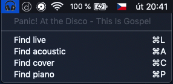

# 🎧 songfinder

Little tool for youtube search of live live/acoustic/cover versions of song you are currently listening to in **iTunes** or **Spotify**. Tested on macOS 10.14 with SWIFT5.

If you love music you know artists that makes incredible live performance of their songs. Lot of these masterpieces are available on YouTube, but not on iTunes or Spotify. Live, acoustic, piano or cover version could better fit to your taste. This tool can help you to find them easily and enjoy music in another way. ♥️

Songfinder came from previous CLI version called [findlive](https://github.com/martingabriel/findsonglive).

## Easy to use

Songfinder can recognize what song are you currently listening to and it will open your default web browsers new tab with youtube search of currently playing song in your music player (iTunes or Spotify are supported now). You select version of search in menu by clicking the icon.

## Example

## References

Spotify bridge inspired by [@gf3](https://github.com/gf3) 🙏